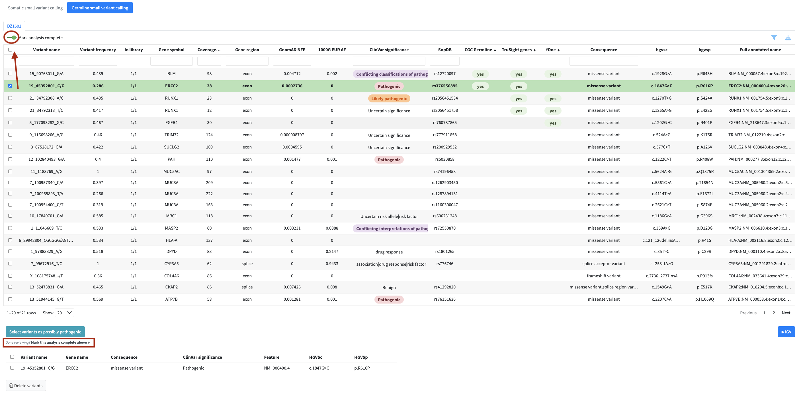

---
output:
  bookdown::bs4_book:
    bootswatch: dark
    css: "custom-styles.css"
---

# Working with Tables {-}

All data in SeqUIaSCOPE — variants, fusions, and expression results — is displayed using
interactive tables built with the `reactable` package. This page describes the features
common to all tables. You do not need to read it before exploring the modules, but it is
worth coming back to if something in a table behaves unexpectedly.

---

## Default Filters {-}

When you first open a module, the table is not necessarily showing all available data.
Each module applies a set of default filters on load to focus the view on the most
clinically relevant entries and keep the application responsive with large datasets.

For **somatic and germline variant calling**, the default filters are the most restrictive —
see [Variant Calling — Default Filters](#default-filters-applied) for the exact criteria.
For **fusion gene detection** and **expression profile**, default filters are less aggressive
but the column selection in the filter menu may hide some columns by default.

::: {.alert .alert-warning}
**If the table appears empty or unexpectedly small**, check the active filters before assuming
data is missing. The filter menu and the column filter inputs above each column header show
what is currently applied.
:::

---

## Sorting {-}

Click any column header to sort the table by that column. Clicking again reverses the order.
A third click removes the sort.

**Multi-column sorting** is supported by holding `Shift` while clicking additional column
headers. This sorts first by the primary column, then by each additional column in the order
you clicked them. To remove a secondary sort, hold `Shift` and click the column header again
until it cycles back to unsorted.

```{r, echo=FALSE, out.width="100%"}
knitr::include_graphics("./screenshots/variant-table-sort.png")
```

---

## Filtering and Column Visibility {-}

Each column has a filter input directly below the header. Typing in a filter box narrows
the table to rows matching your input in that column. Filters across multiple columns are
combined — a row must satisfy all active filters to remain visible.

The **filter menu** (accessible via the filter icon above the table) provides additional
filtering options specific to each module, as well as a column visibility selector that
lets you show or hide individual columns to focus on what matters for your analysis.

```{r, echo=FALSE, out.width="100%"}
knitr::include_graphics("./screenshots/variant-calling-filter.png")
```

::: {.alert .alert-success}
**Tip:** Apply filters before flagging variants or fusions for the report. Working with a
filtered subset significantly reduces table reload times and keeps the application responsive.
:::

---

## Resizing Columns {-}

Column widths can be adjusted by dragging the border between column headers left or right.
This is available in all main data tables (variants, fusions, expression).

---

## Exporting Data {-}

Each table can be exported using the download button above it. Clicking it opens a small
panel with two dropdowns. The first selects the data scope, either all data or only the rows
currently visible after applying your filters. The second selects the file format from CSV,
TSV, or Excel, with TSV preselected. The Download button then saves the file.

```{r, echo=FALSE, out.width="100%"}
knitr::include_graphics("./screenshots/variant-calling-download.png")
```

---

## Flagging Items for the Report {-}

for inclusion in the final clinical report. Flagged items appear in a dedicated review 
panel below the table where you can check your selection and remove items if needed.

```{r, echo=FALSE, out.width="100%"}
knitr::include_graphics("./screenshots/variant-calling-pathogenic.png")
```

In the variant calling and fusion modules, flagged items also become available for inspection in the IGV genome browser within the same module.

```{r, echo=FALSE, out.width="100%"}
knitr::include_graphics("./screenshots/variant-calling-igv.png")
```

::: {.alert .alert-warning}
**Only flagged items are included in the final report.**
:::

## Marking an Analysis as Complete {-}

Each analysis module has a switch labeled **Mark analysis complete** in the top left of the
table header. It records whether you have finished reviewing that dataset for the current 
patient. The switch has two positions, in progress and complete, so you can see which datasets 
still need attention and which are done.

Beneath the Select button there is a short reminder pointing back to the switch, so once you
finish flagging you know where to mark the dataset as reviewed.

In the expression module the switch sits above the two tabs rather than inside them, because
completion applies to the whole expression dataset at once, not to the Genes of Interest and
All Genes tabs separately.

The state is stored per patient and per dataset. Marking a dataset complete also updates its
box on the summary screen, described in [Summary and Report](#summary-and-report).

```{r, echo=FALSE, out.width="100%"}

```

